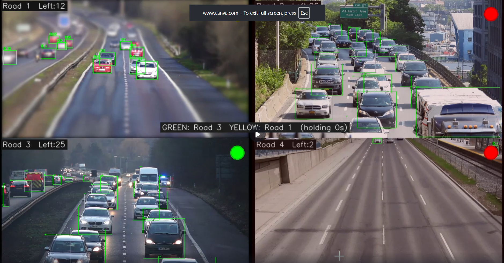

# Automated Traffic Lights Management System



## Overview
This project implements an intelligent, computer vision-based traffic management system designed to use real-time data to dynamically control traffic lights at a 4-way intersection. Unlike traditional fixed-time traffic signals, this system employs live camera feeds (or videos) to measure vehicle density on each road and optimize the green light duration accordingly. The primary goal is to reduce traffic congestion, minimize travel time, and dramatically improve overall intersection efficiency by intelligently adapting to live traffic conditions.

## Key Features
- **Real-Time Vehicle Detection:** Utilizes the YOLOv8 object detection model to accurately detect and capture vehicles such as cars, buses, truks, and motorcycles.
- **Object Tracking:** Employs tracking algorithms (ByteTrack) to assign unique IDs to vehicles, ensuring accurate counting across frames without double-counting.
- **Dynamic Signal Allocation:** Automatically gives the green signal to the lane with the highest vehicle density, minimizing wait times for heavily congested lanes.
- **Early Phase Switching (Empty Lane Detection):** Intelligently overrides the regular green light timer—if a lane is currently green but empties out before its time finishes, the system immediately shifts to the next most crowded lane.
- **Fairness & Starvation Prevention:** Tracks how many times each lane has been served in a cycle, ensuring lanes with fewer vehicles aren't completely ignored for long periods.
- **Lane Direction Filtering:** Employs center-line detection to ensure only vehicles approaching the intersection (on the left side of the frame) are counted toward the traffic density, largely ignoring outgoing traffic.
- **Intuitive Dashboard:** A 2x2 grid dashboard built with OpenCV allowing real-time visualization of scanning, tracking, bounding boxes, counts, and traffic light statuses.

## Tech Stack
- **Language:** Python
- **Computer Vision:** OpenCV (`opencv-python`)
- **Deep Learning Model:** YOLOv8 (`ultralytics`)
- **Tracking Tools:** `lapx`, `filterpy`, `scipy`, `numpy`

## Setup & Installation

1. **Clone the repository** (if you haven't already):
   ```bash
   git clone <repository_url>
   cd Automated-Traffic-Lights-Management-System
   ```

2. **Create a virtual environment (optional but recommended):**
   ```bash
   python -m venv venv
   # On Linux/MacOS
   source venv/bin/activate
   # On Windows
   venv\Scripts\activate
   ```

3. **Install dependencies:**
   Make sure you have a compatible Python version installed. Then run:
   ```bash
   pip install -r requirements.txt
   ```

4. **Prepare Video Feeds:**
   The project expects exactly 4 video feeds corresponding to the 4 paths at the intersection. Ensure that the `VIDEO_FILES` array in `config.py` points to valid `.mp4` video files (e.g., `road1.mp4`, `road3.mp4`, etc.). Make sure those videos are placed in the root directory prior to running.

## Usage

To start the intelligent traffic controller system, run the main script:
```bash
python main.py
```

### Controls & Navigation
- The dashboard visually showcases real-time vehicle counting. 
- During the **Scan Phase**, it assesses the vehicle density per lane.
- During the **Hold Phase**, the traffic light allows traffic on the chosen lane to pass.
- The next lane queued to receive a Green signal is indicated with **Yellow**.
- Press **`Esc`** at any time to softly exit the dashboard and close the application cleanly.

## Advanced Configuration (`config.py`)
You can tweak the core behavior of the traffic system inside `config.py`:
- `SCAN_SEC`: Time allocated for scanning all lanes to compute initial vehicle densities.
- `HOLD_SEC`: The baseline max duration of a green light phase.
- `EMPTY_THRESHOLD_SEC`: The time threshold before early phase switching activates when a green lane falls empty.
- `MIN_CONF`: Minimum confidence threshold for the YOLOv8 detector.
- `DETECT_LEFT_ONLY`: Toggle filtering for lane-specific detection (incoming traffic).
